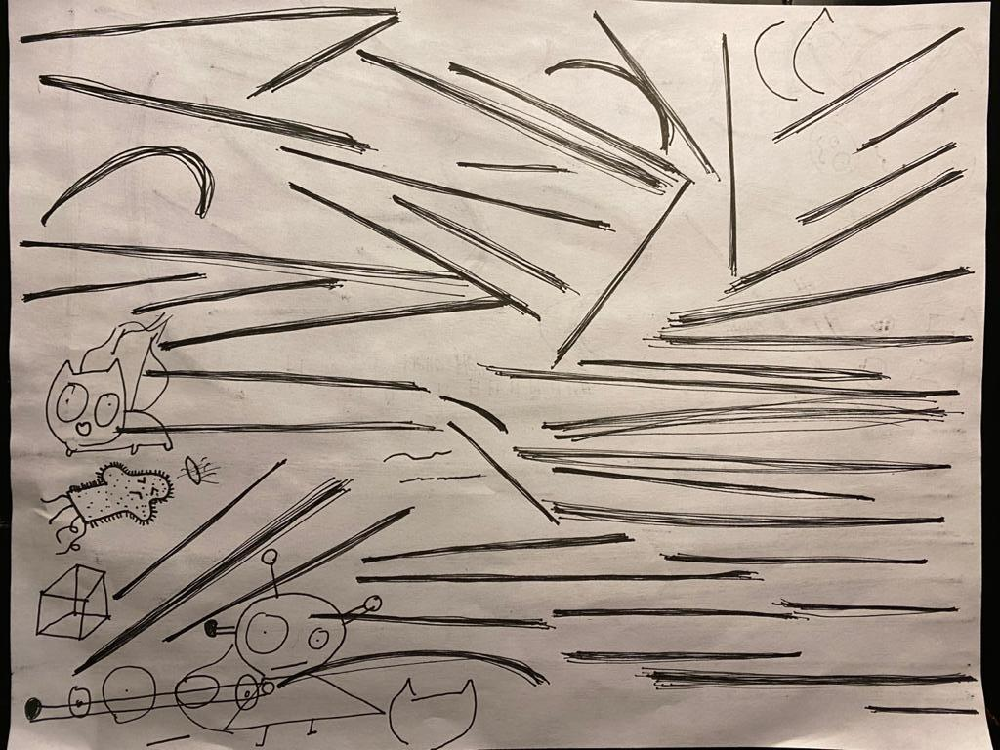
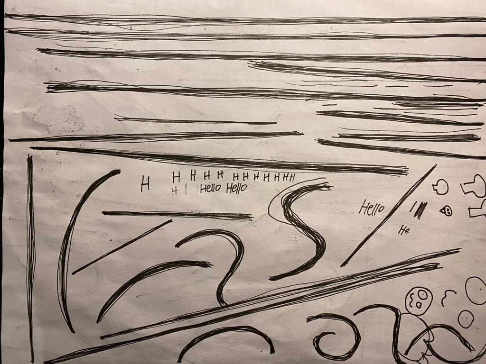
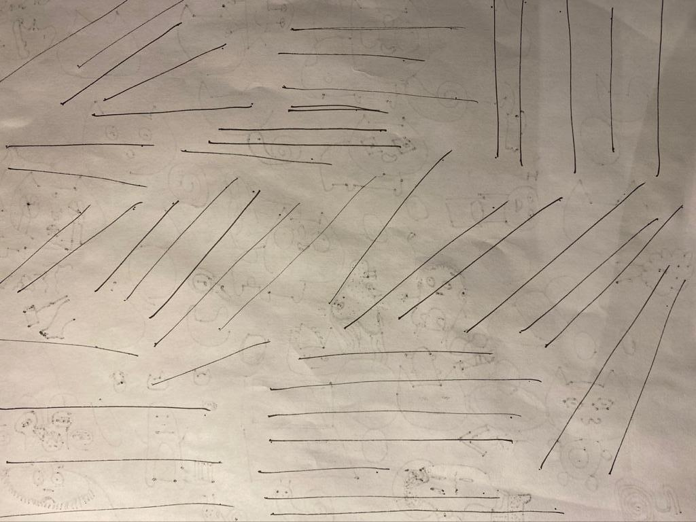

This is the first lesson of Draw A Box. I started this on Sunday April 5th. For those interested, Draw A Box is an online free website dedicated to teaching anyone art fundamentals. I saw it recommended frequently online and decided to give it a shot. The class is structured in a lesson -> exercise format with most of the actual work coming from lengthy repetitive drawing exercises.

The first section of lesson 1 deals with lines. My major takeaways from this lesson are:
* Straight uniform lines are essential
* Once you start making a line you are comitted to following through
* You can draw from your wrist, your elbow, and your shoulder
    * Every drawing done for the class should be done from the shoulder to train

I've always considered myself bad at drawing and any art related activities in general. It seemed like lots of repetitive activities would be a good way to start working on changing this.

Anyways, here are the pictures from the first few exercises in Lesson 1. Was funny because of how unconfident I felt even drawing straight lines, almost nervous even. From doing these activities my biggest need for improvement is to stop arcing my lines and to be a tad bit less wobbly.
Gonna post these as jpeg's right now but will experiment with changing up how I do this

